# 🩺 Early Disease Risk Prediction

> **AI-powered multi-disease risk prediction system for early detection and preventive healthcare using machine learning.**

---

## 🌐 Live Demo

🔗 https://early-disease-risk-prediction.streamlit.app/

---

## 📌 Problem Statement

Chronic diseases like **Diabetes, Heart Disease, Stroke, and High Blood Pressure** are among the leading causes of death worldwide.
Early detection is critical, but access to timely medical screening is often limited.

This project aims to **leverage machine learning to predict disease risks early**, enabling individuals to take preventive actions before conditions become severe.

---

## 🎯 Project Objective

* Predict the risk of multiple diseases using patient health indicators
* Provide **probability-based predictions** instead of just binary output
* Generate a **comprehensive risk score**
* Make predictions accessible via an **interactive web interface**

---

## 🚀 Features

✅ Multi-disease prediction:

* Diabetes
* Heart Disease
* Stroke
* High Blood Pressure

✅ Risk scoring system
✅ Probability-based predictions
✅ Interactive **Streamlit UI**
✅ Feature importance using **SHAP explainability**
✅ Model comparison & evaluation visualizations
✅ Handles imbalanced data using **SMOTE**

---

## 🧠 Input Features

* Age
* BMI
* HighChol
* PhysActivity
* Smoker
* PreventiveCareIndex
* RiskScore

---

## 🤖 Machine Learning Models Used

* Logistic Regression (Baseline)
* Weighted Logistic Regression
* SMOTE Logistic Regression
* Random Forest
* XGBoost
* **XGBoost + SMOTE (Best Model)** ⭐

---

## 📊 Results & Performance

| Model                        | ROC-AUC Score |
| ---------------------------- | ------------- |
| XGBoost + SMOTE              | **0.844**     |
| Logistic Regression          | 0.840         |
| Weighted Logistic Regression | 0.840         |
| SMOTE Logistic               | 0.839         |
| XGBoost                      | 0.820         |
| Random Forest                | 0.782         |

📌 **Best Model:** XGBoost + SMOTE

* Handles class imbalance effectively
* Provides superior predictive performance

---

## 📈 Visualizations

### ROC-AUC Curve
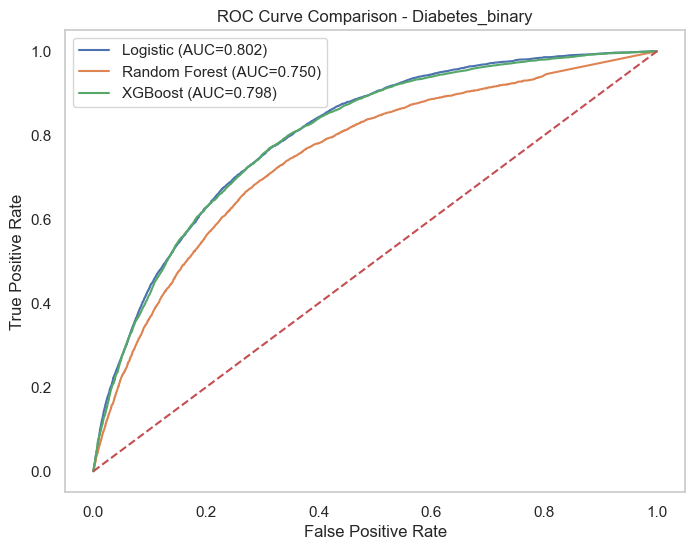
### Confusion Matrix
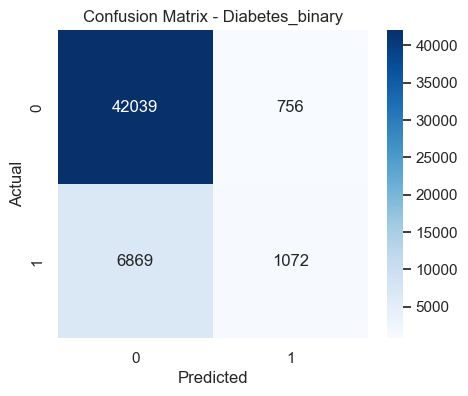
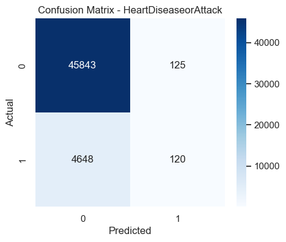

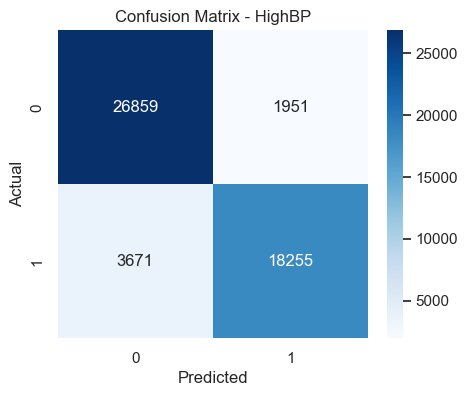

### Class Imbalance Distribution
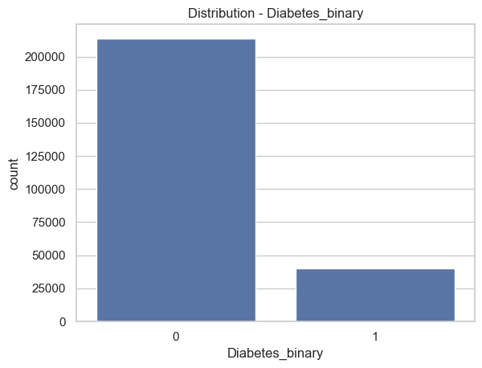
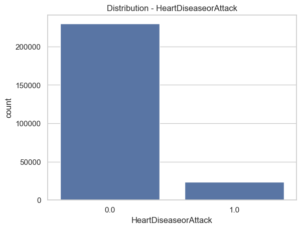
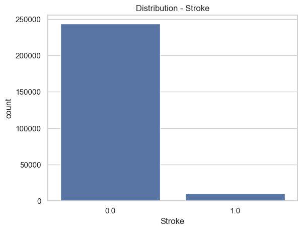
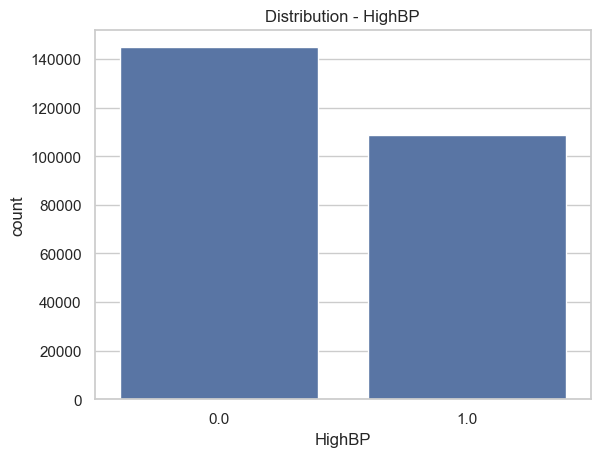

### Feature Importance Graphs
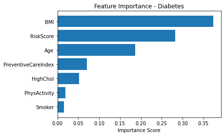
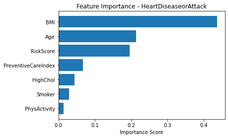

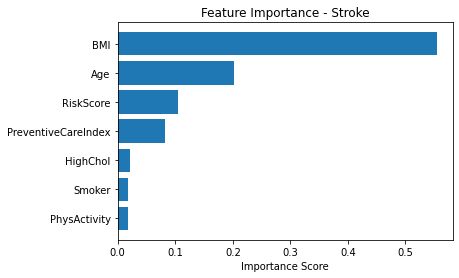

*(See `/reports/figures/` for all visuals)*

---

## 🔍 Explainability

This project uses **SHAP (SHapley Additive exPlanations)** to:

* Interpret model predictions
* Identify most important health factors
* Improve transparency and trust

---

## 📂 Dataset

📌 Source: https://www.kaggle.com/datasets/alexteboul/diabetes-health-indicators-dataset

### 🎯 Target Variables:

* Diabetes_binary
* HeartDiseaseorAttack
* Stroke
* HighBP

---

## 🏗️ Project Structure

```
early-disease-risk-prediction/
├── app/
├── data/
├── models/
├── notebooks/
├── reports/
├── src/
└── requirements.txt
```

---

## ⚙️ Installation & Setup

```bash
# Clone the repository
git clone https://github.com/your-username/early-disease-risk-prediction.git

# Navigate to project directory
cd early-disease-risk-prediction

# Install dependencies
pip install -r requirements.txt

# Run the app
streamlit run app/app.py
```

---

## 🖼️ Screenshots

### 🏠 Home Page
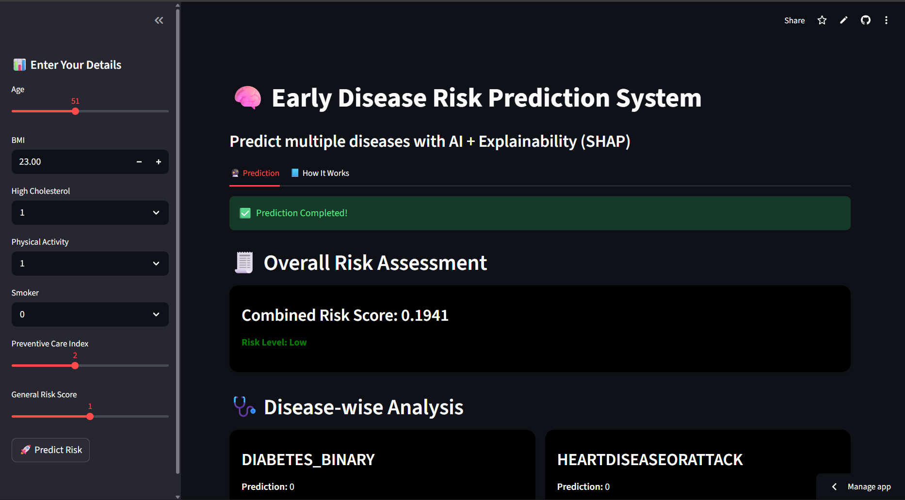

### 📝 Input Form
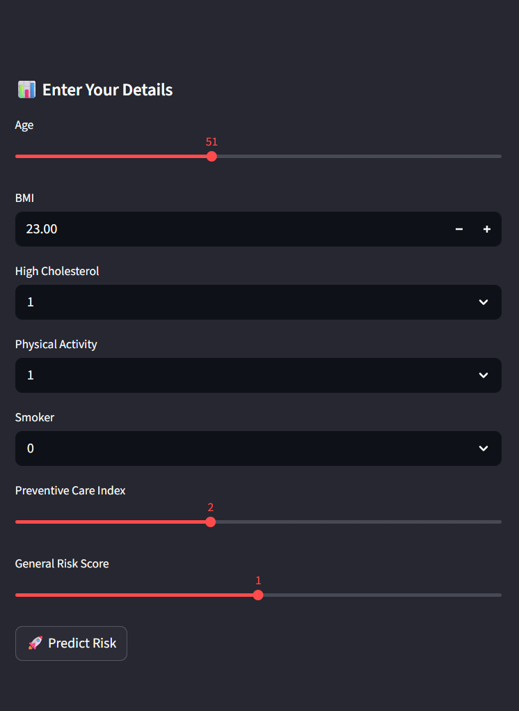

### 📊 Prediction Result
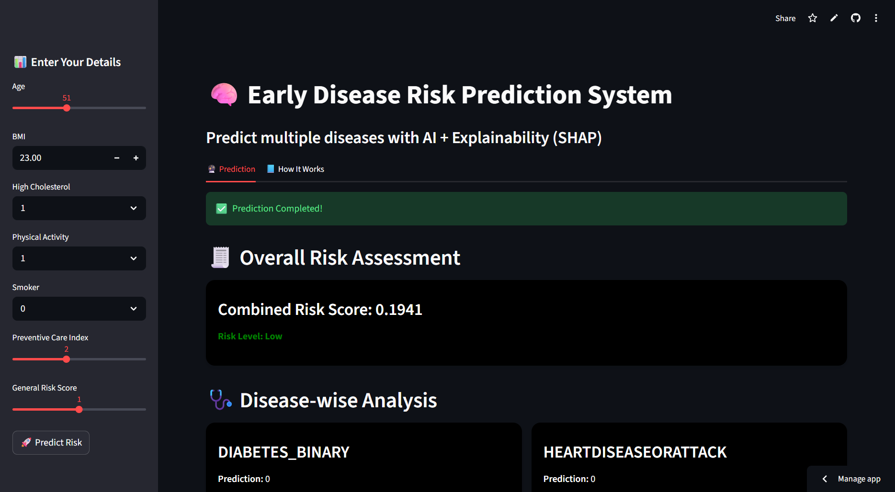

---

## 💡 Future Improvements

* Add more diseases (e.g., cancer risk, kidney disease)
* Improve model performance using deep learning
* Deploy as a full-stack web or mobile application
* Integrate real-time health monitoring (IoT devices)
* Personalized health recommendations

---

## 👨‍💻 Author

**Vishnu Gupta**

* 🎓 Computer Science Engineering Student
* 💻 Aspiring Full Stack & ML Developer

---

## ⭐ If you like this project

Give it a ⭐ on GitHub and feel free to contribute!

---
